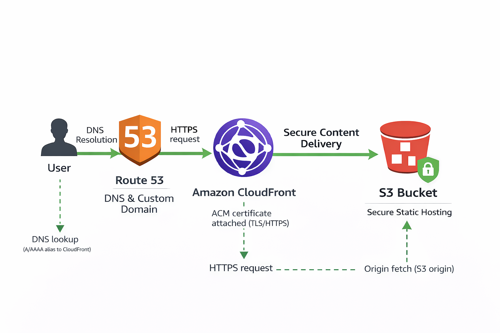

# Terraform AWS Website Infrastructure 

## Project Overview
This project provisions a **2-tier AWS web environment** using **Terraform**. It automates the setup of an S3 static website and EC2-based backend within a custom VPC providing a foundational Infrastructure-as-Code example for cloud and DevOps roles.

---

## AWS Services Used
- **Amazon S3** — Static website hosting for `index.html` and `error.html`.
- **Amazon EC2** — Hosts web or app server instance.
- **Amazon VPC** — Custom virtual network with subnet and route configurations.
- **Security Groups** — Defines inbound and outbound rules for EC2 access.
- **IAM** — (Optional) Service roles and permissions for resource management.
- **Amazon CloudFront** — CDN for secure delivery in front of S3.
- **AWS Certificate Manager (ACM)** — SSL/TLS certificate for HTTPS.
- **Amazon Route 53** — DNS routing for custom domain.


---

## 📂 Project Structure
```
AWS-website/
│── provider.tf               # AWS provider configuration
│── vpc.tf                    # VPC setup and networking
│── ec2.tf                    # EC2 instance provisioning
│── security-groups.tf        # Security group configurations
│── bucket.tf                 # S3 bucket setup for website hosting
│── variable.tf               # Input variables
│── index.html                # Main website page
│── error.html                # Custom error page
```

---

## HTTPS + Custom Domain (AWS Console)
To take this project a step further and reinforce Security+ concepts, I secured the website using a custom domain and HTTPS.

- **ACM (AWS Certificate Manager)** to request an SSL/TLS certificate
- **CloudFront** in front of S3 (secure delivery)
- **Route 53** to route the custom domain to CloudFront via Alias record



**[Result](asiaflemng.me):** The site loads securely over **HTTPS (TLS)** with a valid certificate.


---

## Skills Demonstrated
- Infrastructure-as-Code (IaC) with **Terraform**
- AWS networking and resource provisioning
- S3 website configuration and permissions
- Cloud automation fundamentals

---

## Room for Growth
- Integrate **CloudWatch** for logging and monitoring  
- Build CI/CD with GitHub Actions for automatic deployment  
- Add Terraform **outputs.tf** for cleaner resource referencing  

---

Created by **Asia Fleming**   
